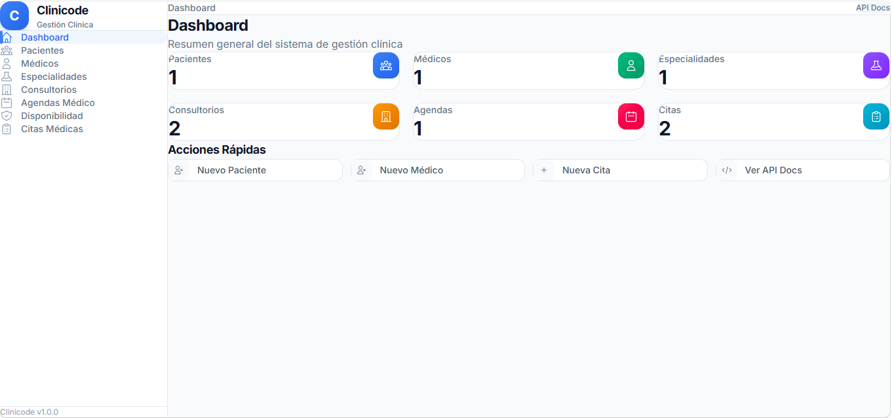
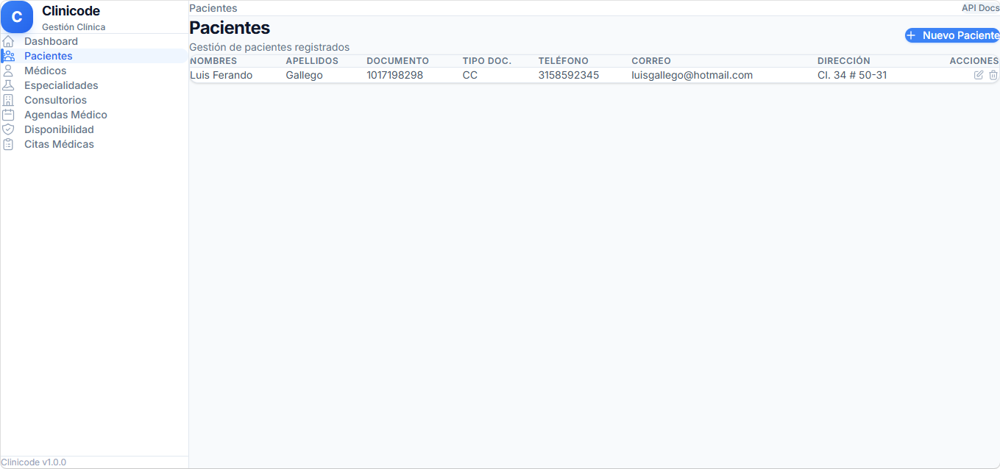
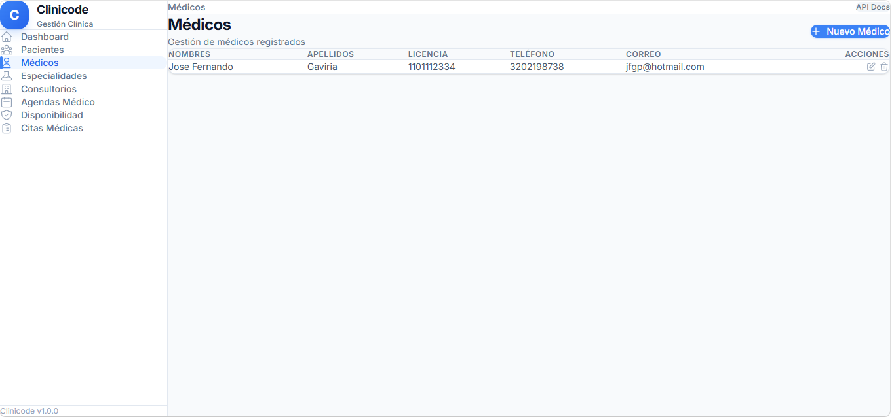
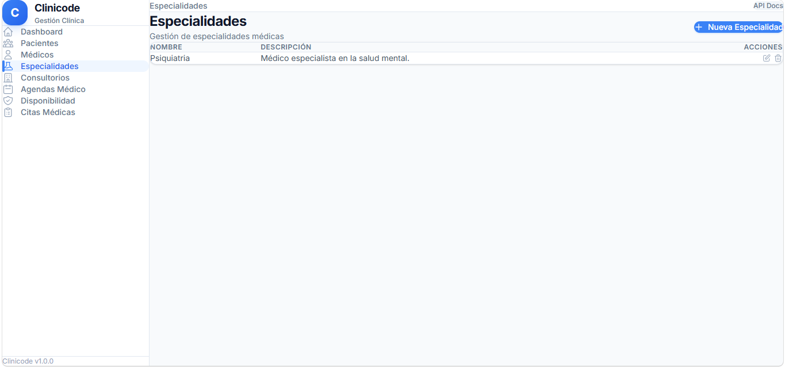
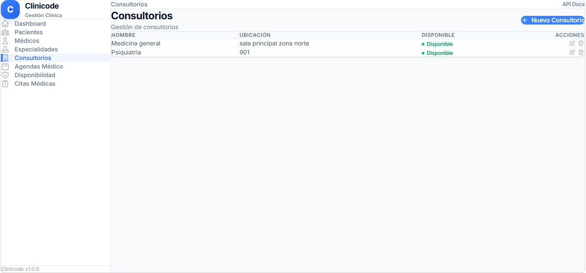
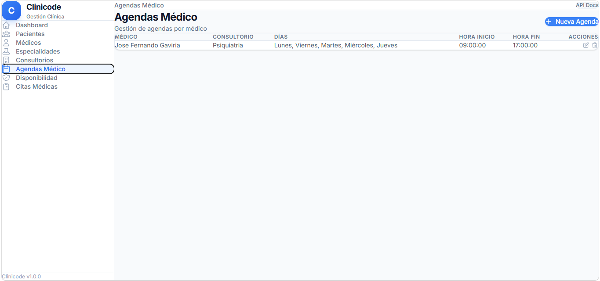
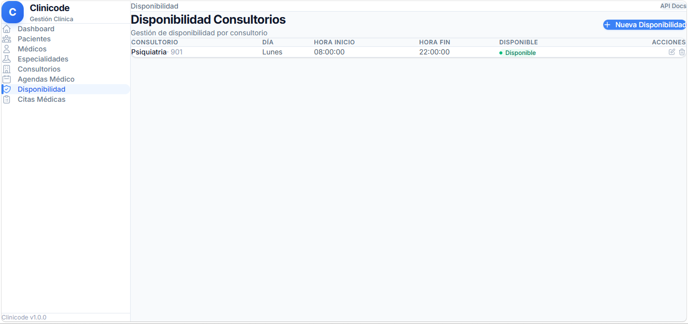
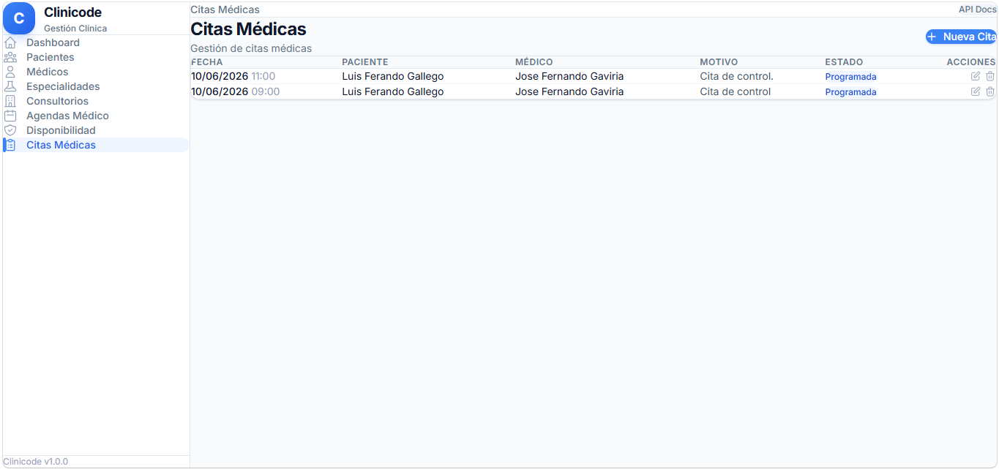

# Clinicode - Sistema de Gestión Clínica

Aplicación full-stack para la gestión de una clínica médica. Backend con **Node.js**, **TypeScript**, **Fastify** + **PostgreSQL**. Frontend con **React**, **Vite** y **Tailwind CSS v4**.

## Stack Tecnológico

| Capa     | Tecnologías                                             |
| -------- | ------------------------------------------------------- |
| Backend  | Node.js, TypeScript, Fastify, PostgreSQL, Zod, Swagger  |
| Frontend | React 19, Vite 8, Tailwind CSS v4, React Router, Axios |
| Testing  | Jest, Supertest                                         |

## 🎥 Demo

[](https://youtu.be/lxHfnA_TJSE)

## 📸 Pantallas

| Módulo | Vista |
|--------|-------|
| **Dashboard** |  |
| **Pacientes** |  |
| **Médicos** |  |
| **Especialidades** |  |
| **Consultorios** |  |
| **Agenda del Médico** |  |
| **Disponibilidad Consultorio** |  |
| **Citas Médicas** |  |

## Entidades

- **Pacientes** — CRUD completo
- **Médicos** — CRUD completo
- **Especialidades** — CRUD completo
- **Consultorios** — CRUD completo
- **Agendas Médico** — CRUD completo (agenda por médico)
- **Disponibilidad Consultorio** — CRUD completo (horarios por consultorio)
- **Citas Médicas** — CRUD completo

## Requisitos

- Node.js 18+
- PostgreSQL 14+
- npm

## Configuración

### 1. Clonar e instalar

```bash
git clone https://github.com/Inexsu-Coordinadora/Clinicode.git
cd Clinicode

# Instalar backend
npm install

# Instalar frontend
cd frontend
npm install
cd ..
```

### 2. Variables de Entorno

Crear archivo `.env` en la raíz:

```env
DB_USER=postgres
DB_PASSWORD=tu_password
DB_HOST=localhost
DB_PORT=5432
DB_NAME=clinicode
PORT=3000
```

### 3. Base de Datos

Ejecutar las migraciones contra tu base PostgreSQL:

```bash
psql -U postgres -d clinicode -f migraciones/migraciones.sql
```

### 4. Ejecutar

```bash
# Backend (desde la raíz)
npm run dev

# Frontend (desde frontend/)
cd frontend
npm run dev
```

- **Backend**: http://localhost:3000
- **Documentación Swagger**: http://localhost:3000/docs
- **Frontend**: http://localhost:5173

## Scripts

### Backend
| Comando               | Descripción                        |
| --------------------- | ---------------------------------- |
| `npm run dev`         | Inicia servidor con hot-reload     |
| `npm run build`       | Compila TypeScript a JS            |
| `npm start`           | Ejecuta compilado de producción    |
| `npm test`            | Ejecuta todos los tests            |
| `npm run test:unit`   | Tests unitarios                    |
| `npm run test:integration` | Tests de integración          |

### Frontend
| Comando           | Descripción                    |
| ----------------- | ------------------------------ |
| `npm run dev`     | Inicia servidor de desarrollo  |
| `npm run build`   | Compila para producción        |
| `npm run preview` | Previsualiza build producción  |

## Estructura del Proyecto

```
Clinicode/
├── src/
│   ├── core/
│   │   ├── dominio/          # Entidades, interfaces, schemas Zod
│   │   │   └── entidades/    # paciente, medico, especialidad, etc.
│   │   └── aplicacion/       # Casos de uso
│   ├── infraestructura/
│   │   └── persistencia/     # Repositorios PostgreSQL
│   └── presentacion/
│       ├── controladores/    # Fastify route handlers
│       ├── rutas/            # Definición de rutas con OpenAPI schemas
│       └── app.ts            # Configuración de Fastify + Swagger
├── frontend/
│   └── src/
│       ├── api/              # Servicios HTTP (axios)
│       ├── components/       # Layout, DataTable, Modal
│       └── pages/            # Dashboard, Pacientes, etc.
├── docs/                     # Documentación
│   ├── images/               # Capturas de pantalla
│   ├── swagger.md            # Guía de Swagger UI
│   └── api-guia.md           # Referencia de endpoints
├── migraciones/
│   └── migraciones.sql       # Schema de base de datos
└── README.md
```

## Documentación

- **Swagger UI**: http://localhost:3000/docs (interactivo)
- **docs/swagger.md**: formato de respuestas
- **docs/api-guia.md**: referencia de endpoints

## Tests

```bash
# Todos los tests
npm test

# Solo unitarios
npm run test:unit

# Solo integración
npm run test:integration
```

El proyecto sigue **Clean Architecture** con separación clara de dominio, aplicación e infraestructura. Cada entidad tiene su propio caso de uso, controlador y endpoints REST.
